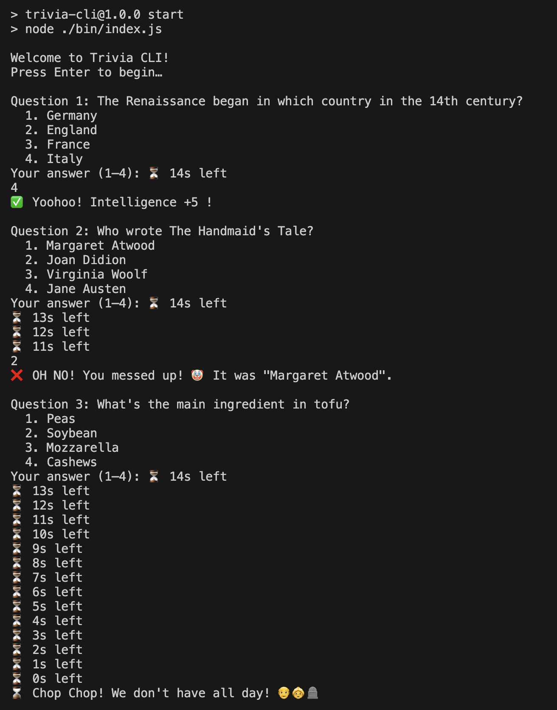

# Trivia CLI

A simple, interactive command-line trivia game built in Node.js—designed with core JavaScript skills (loops, functions, timers, arrays/objects) and deliver immediate feedback to the user.

## Table of Contents

- [Demo](#demo)  
- [Features](#features)  
- [Prerequisites](#prerequisites)  
- [Installation](#installation)  
- [Usage](#usage)  
---

## Demo



---

## Features

-  **Interactive CLI** — clean prompts powered by Node’s `readline` (or swap in [Inquirer](https://www.npmjs.com/package/inquirer)).  
-  **Timed Questions** — each question has a 15-second countdown with live tick-downs.  
-  **Instant Feedback** — tells you immediately if you’re correct, and shows the right answer if you’re not.  
-  **Scoring** — tallies your correct answers and shows a final score at the end.  
-  **Modular Code** — questions, timer, and game flow separated into distinct modules.

---

## Prerequisites

- [Node.js](https://nodejs.org/) v16 or above  
- npm (bundled with Node.js)

---

## Installation
   **Clone the repo**  
   ```bash
   git clone https://github.com/your-username/trivia-cli.git
   cd trivia-cli
3. Install dependencies
     `npm install`
4. Run the game
  `npm start`

## Usage
   
	•	On launch, press Enter to begin.

	•	For each question, type 1, 2, 3, or 4 to select your answer.

	•	You have 15 seconds per question—watch the countdown!

	•	At the end, your total score is displayed.

Requirements
	•	Node.js v14 or higher
	•	npm
